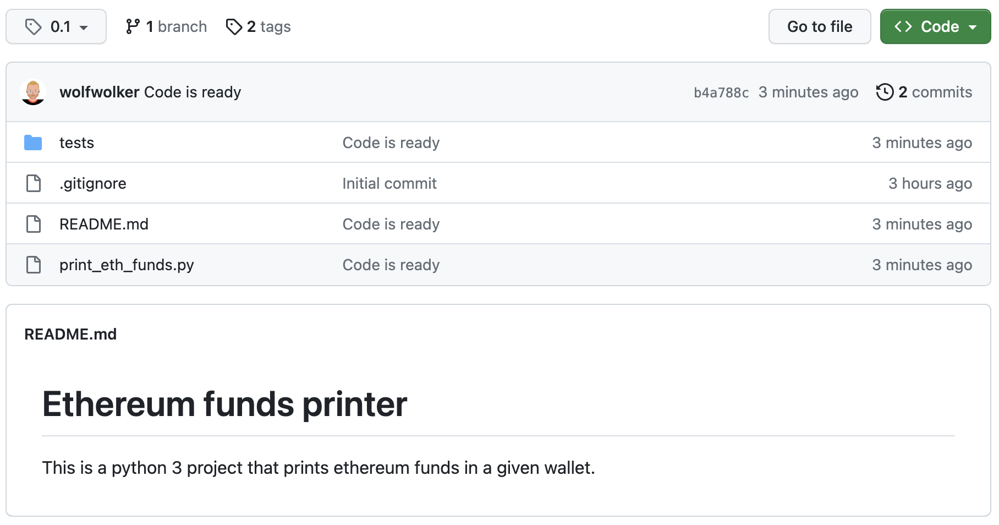
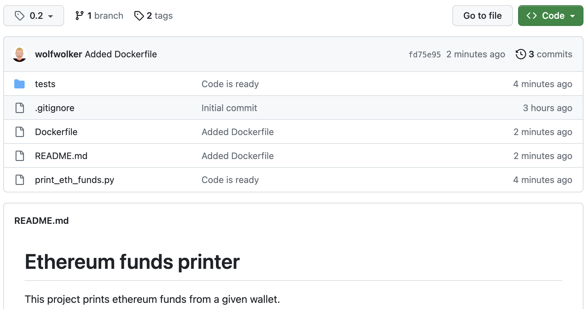

# Embracing "You Build It, You Run It" methodology: baby steps from DevOps to Platform Engineers

## What does "You build it, you run it" mean?

"You build it, you run it" is a software development principle that emphasizes the responsibility of developers to be involved in the entire lifecycle of the software they create. It originated from Amazon's software development culture and was famously promoted by Werner Vogels, Amazon's Chief Technology Officer.

In a nutshell, it means that developers are not just responsible for writing code and tossing it over the wall to the operations team. Instead, they own the entire lifecycle of their creations. From the moment they start coding to the time it's running smoothly in production, they're the driving force behind it all. This includes continuous integration, automated deployments, monitoring, incident response, and post-deployment support. Yep, they've got the whole package!

## Back to the reality, what does it would mean for us?

**Developers won't do any of that! but instead, document how to operate their applications**. This is a great way to start embracing the "You build it, you run it" philosophy. By documenting how to operate their applications, developers can gain a deeper understanding of production requirements, and that will improve relation with the devops team and overall product quality.

### Documentation is never good enough

Let's be clear: on any project documentation is good enough. Why? because it is impossible to measure and therefore it always meets the Definition of done requirements, even if the documentation is a couple sentences it is still documentation. However, this doesn't mean they can't harness the power of **Docker to document** their applications properly and promote good practices in their architecture.

From a devops perspective, the dockerfile, the image, and the `docker run` commands are the operational documentation for the application. **Any devops joining the project would be capable of building an environment based only on the requirements detailed on those files**, without requiring any additional project context. **Even if the project is not intended to run on production using containers, the dockerfile is still a great reference** to detail the kind of environment the application requires.

Not only that, but by running the `docker run` command with the image provided, the devops team can validate the application starts as expected in a matter of minutes.

Here there are a couple examples of DoD enforcing (and not) the use of Docker to document the applications:

#### Project not enforcing the use of Dockerfile

##### Definition of done

- Code is written and tested with a coverage of >80%
- Functional documentation is written in markdown
- Operational documentation is written in markdown



As you can see in the screenshot, this project is meeting the DoD requirements. A single line in the readme file is enough to meet the DoD requirements, **it tells the language used and what the app does**, and therefore the project would be ready to be delivered. However, the operational documentation is not enough to deploy the application to production, and therefore the devops team will have to spend time and effort to understand the application and build the environment.

#### Project enforcing the use of Dockerfile

##### Definition of done

- Code is written and tested with a coverage of >80%
- Functional documentation is written in markdown
- Dockerfile, docker image and `docker run` command are provided



As you can see in the screenshot, this project is still far from being perfect, but the Dockerfile includes specific details about the environment the application requires, and therefore the devops team can build the environment without the need of additional information. **The dockerfile is the operational documentation** for the application.

### Leveraging Docker for Documentation

When developers create a Dockerfile for their application with production-like arguments and settings, they're essentially providing a detailed blueprint of how the application should be deployed and run in a production-ish environment.

By doing this, they create a self-contained unit that encapsulates everything needed to run the application, making it easy for DevOps engineers to deploy it to various environments. This process not only ensures consistency but also eliminates the "works on my machine" syndrome, which is a common source of frustration and delays in software development.

### Bad smells detection

When developers construct a Docker image for their application, they're documenting the application's requirements, dependencies, and configurations as code. This kind of "infrastructure-as-code" approach ensures that the environment is well-documented and reproducible.

However, there's an interesting side effect to this practice: it can help identify potential issues or improvements in the application architecture. If a developer is unable to create a Docker image for their application, it could be a sign of architectural problems or dependencies that are not explicitly stated or managed. This raises a "bad smell" in the application, signaling that something needs attention. Let's take the previous application dockerfile as example:

```Dockerfile
FROM python:3.8
WORKDIR /app
COPY . /app
RUN pip install prettytable web3 eth-utils
EXPOSE 80
ENV ETH_WALLET 0x1234567890123456789012345678901234567890
CMD ["python", "print_eth_funds.py"]
# use this command to run the container
# docker run -p 4000:80 my-python-app 
```

Easily we can observer a couple of bad smells hard to detect with the markdown operational documentation instead of the dockerfile:

- there is a config secret hardcoded in the dockerfile
- the requirements are not properly managed

### Enforcing Good Practices

Through Docker, developers can enforce good practices in their application architecture. By iteratively improving the Docker setup and addressing issues, we promote cleaner, more modular, and easily maintainable applications.

### Better pre-production environments

By setting Dockerfiles as a project baseline, devops can provide better and cheaper pre-production environments in less time. Even if the project is not intended to run using containers in production, the potential to build a containerized environment for pre-production is a great advantage. Docker is a great tool to use as abstraction layer to **create homogeneous projects**, and therefore be able to share CI/CD scripts and speed up the pipelines creation and deployment process.

### Devops as a service

Having homogeneous projects, at least from an operational perspective, makes easier to move devops resources from one project to another. This is a great advantage for companies that provide devops as a service, as they can easily move resources from one project to another without the need of a long onboarding process.

## Transitioning to Full Ownership

While we acknowledge that developers might not initially operate their applications in production, the process of documenting applications through Docker paves the way for a smooth transition towards full ownership.

As they mature in their development practices, they'll become more familiar with the production environment requirements, operational considerations, and customer needs. With time, developers will feel more confident about taking on the responsibility of operating their applications in production.

This devops-lution is a natural progression towards becoming true Platform Engineers and put more effort into operating production workloads and providing the needed tools and support to the development teams for them to be able to help into building the infrastructure for their applications.

## Conclusion

"You build it, you run it" is more than just a catchy phrase – it's a mindset that sets us on a path to becoming true Platform Engineers. By embracing this principle, we'll elevate our skills, enhance our collaboration, and deliver software that wows our customers.
